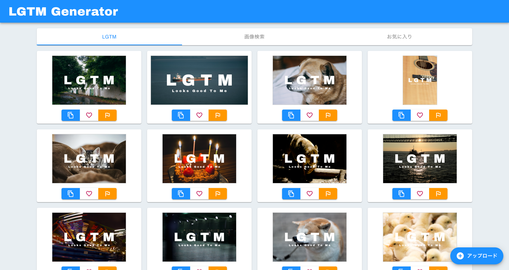

# 概要

[lgtmgen.org](https://lgtmgen.org)

シンプルな LGTM 画像生成サービス。

# アーキテクチャ図

# 開発

[開発環境構築](./docs/development.md)

## 利用技術

- Go
- Gin
- TypeScript
- React
- Next.js
- Docker
- AWS
  - CloudFormation
  - API Gateway
  - Lambda
  - Certificate Manager
  - Route 53
  - CloudWatch
  - DynamoDB
  - CloudFront
  - S3
  - ECR
- GCP
  - Custom Search API
- Vercel
- CircleCI
- Terraform
- Serverless Framework
- Google Analytics
- Sentry

# ライセンス

[MIT](./LICENSE)
